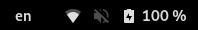

# X11 Keyboard layout indicator as country flags

## About

On [Gnome](https://www.gnome.org/), the keyboard layout is presented as the code of the language which is currently selected. In the example below, the English (US) keyboard layout is selected:



I don't know about you, but a country flag there looks nicer to me instead of the language. After this script runs, this is what that would look like for the English (US) keyboard layout:


Ps: Other keyboard layouts/languages are also available

## Usage

Run the main script as root or with sudo.:

```bash
sudo python ./main.py
```

## More details

- The flags are emojis copied from [getemoji](https://getemoji.com/#flags) and [emojipedia](https://emojipedia.org/flags/)
- The script sets these emojis in the evdev.xml file from X11
- The script makes a backup of the original evdev.xml file before running, if it doesn't exist yet
